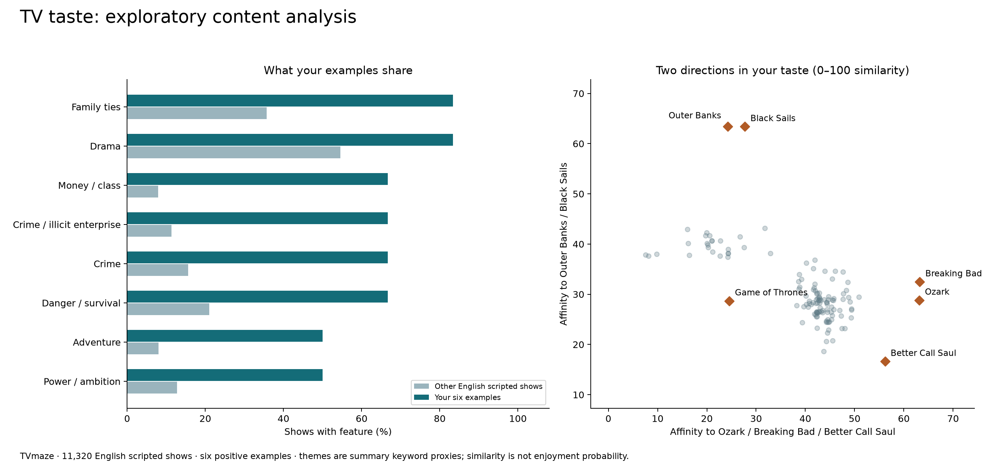
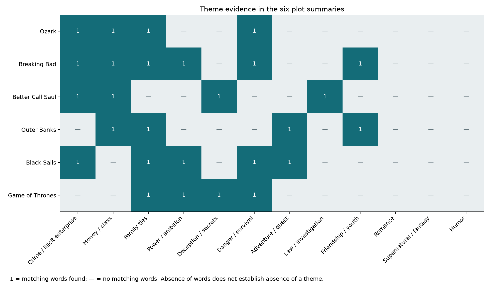
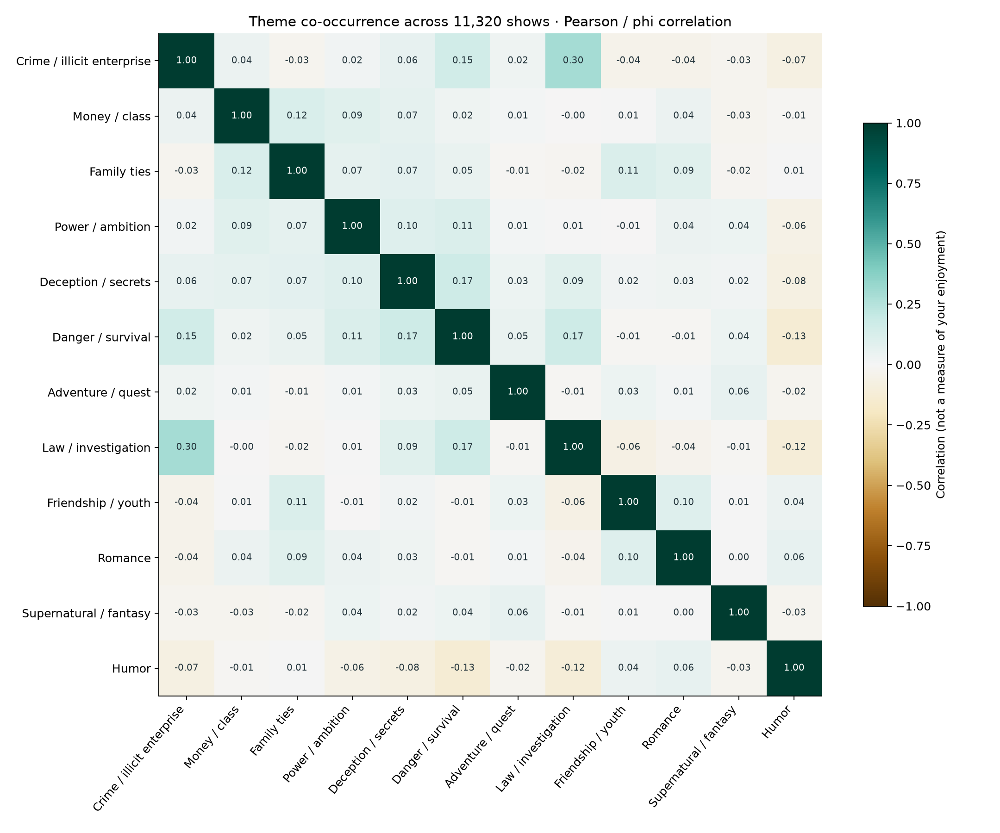

# Your TV taste: a brief exploratory study

The most useful working hypothesis is **people pursuing money or power outside ordinary rules, with family relationships caught in the consequences**. Crime is one route into that pattern; treasure hunting and piracy are another. Moral compromise, escalating consequences, and divided loyalties are plausible interpretations of your examples, not directly measured labels in this dataset.

Analyzed 11,320 English-language scripted shows from a 89,594-record TVmaze snapshot retrieved 2026-09-07. The recommendation pool contains 7,445 shows after excluding your six examples and limiting to premieres from 1990 onward and average runtime of at least 25 minutes. These language, date, and runtime limits are initial assumptions, not preferences you explicitly stated. Public ratings do not affect the score.

**Your examples:** Ozark (the title corresponding to “Ozarks”), Breaking Bad, Better Call Saul, Outer Banks, Black Sails, and Game of Thrones. Five receive weight 1; Game of Thrones receives 0.35 because you said “a bit.” This numeric weight is an analyst choice, checked in sensitivity analysis.

## What stands out

| Feature | Your six examples | Other shows | Descriptive lift |
|---|---:|---:|---:|
| Family ties | 5/6 | 35.7% | 2.3× |
| Genre: Drama | 5/6 | 54.5% | 1.5× |
| Money / class | 4/6 | 7.9% | 8.4× |
| Crime / illicit enterprise | 4/6 | 11.3% | 5.9× |
| Genre: Crime | 4/6 | 15.6% | 4.3× |
| Danger / survival | 4/6 | 21.1% | 3.2× |
| Genre: Adventure | 3/6 | 8.0% | 6.3× |
| Power / ambition | 3/6 | 12.8% | 3.9× |

“Other shows” means the 11,314 non-seed shows in the analysis corpus, including comedy and other genres. These are descriptive ratios, not significant preference effects. We have no disliked shows or representative viewing history. The table uses equal weights for transparent counts; only recommendation scoring downweights Game of Thrones.

## Recommendations from the model

The scores below are content similarity indices, **not probabilities that you will like a show**. The exact order depends on the feature choices; treat this as a sampling list.

| Rank | Show | Similarity / 100 | Rank range when one favorite is omitted |
|---:|---|---:|---:|
| 1 | [Out There (2025)](https://www.tvmaze.com/shows/71213/out-there) | 47.9 | 1–7 |
| 2 | [Trust (2018)](https://www.tvmaze.com/shows/14117/trust) | 46.5 | 1–10 |
| 3 | [Kin (2021)](https://www.tvmaze.com/shows/53750/kin) | 46.2 | 2–4 |
| 4 | [Hiding (2015)](https://www.tvmaze.com/shows/2601/hiding) | 45.2 | 2–12 |
| 5 | [Riviera (2017)](https://www.tvmaze.com/shows/16077/riviera) | 44.9 | 3–15 |
| 6 | [Framed (1992)](https://www.tvmaze.com/shows/46514/framed) | 44.4 | 5–11 |
| 7 | [Gangs of London (2020)](https://www.tvmaze.com/shows/33487/gangs-of-london) | 43.8 | 4–18 |
| 8 | [MobLand (2025)](https://www.tvmaze.com/shows/75026/mobland) | 43.7 | 4–16 |
| 9 | [White Lies (2024)](https://www.tvmaze.com/shows/67239/white-lies) | 43.7 | 6–19 |
| 10 | [Would Be Kings (2008)](https://www.tvmaze.com/shows/24846/would-be-kings) | 43.6 | 3–24 |
| 11 | [Giri/Haji (2019)](https://www.tvmaze.com/shows/34448/girihaji) | 43.5 | 5–28 |
| 12 | [Narcos (2015)](https://www.tvmaze.com/shows/2705/narcos) | 43.4 | 7–19 |

**Where I would start:** [Kin](https://www.tvmaze.com/shows/53750/kin) for family loyalty within organized crime; [Out There (2025)](https://www.tvmaze.com/shows/71213/out-there) for a rural family threatened by drug trafficking; and [MobLand](https://www.tvmaze.com/shows/75026/mobland) for criminal business, family power, and fixers. These are my interpretations of the source summaries, informed by the ranking—not independently validated predictions.

**For the adventure side**, the top lexical matches are:

| Show | Adventure affinity / 100 |
|---|---:|
| [The Philanthropist (2009)](https://www.tvmaze.com/shows/3999/the-philanthropist) | 43.2 |
| [National Treasure: Edge of History (2022)](https://www.tvmaze.com/shows/47928/national-treasure-edge-of-history) | 42.9 |
| [King Solomon's Mines (2004)](https://www.tvmaze.com/shows/43495/king-solomons-mines) | 42.3 |
| [Castaway (2011)](https://www.tvmaze.com/shows/9904/castaway) | 41.7 |
| [Pirate Islands (2003)](https://www.tvmaze.com/shows/19872/pirate-islands) | 41.7 |
| [Crusoe (2008)](https://www.tvmaze.com/shows/1465/crusoe) | 41.5 |
| [Treasure Island (2012)](https://www.tvmaze.com/shows/1670/treasure-island) | 40.7 |

[National Treasure: Edge of History](https://www.tvmaze.com/shows/47928/national-treasure-edge-of-history) is a useful treasure-and-family match to investigate; [Treasure Island (2012)](https://www.tvmaze.com/shows/1670/treasure-island) connects directly with the piracy side. Shared setting does not guarantee the same maturity, pacing, or character depth. Current streaming availability was not researched.

## Correlation and data quality

- The strongest off-diagonal theme association is **Law / investigation with Crime / illicit enterprise**, phi/Pearson r = 0.30. This describes co-occurrence in show descriptions, not your enjoyment.
- Summary length and detected theme count have **Spearman ρ = 0.48**. Longer descriptions expose more themes, a substantial measurement bias.
- Public rating and premiere year have **Spearman ρ = -0.46** among complete pairs. This may reflect coverage, survivor, and voting biases; it does not mean older shows are inherently better.
- **57.2% of ratings are missing** in the analysis corpus; runtime is missing for 1.3%. Ratings were neither filled in nor used to rank.
- Of 12,933 English scripted records, 967 have fewer than 15 summary words and 677 lack a premiere date. These categories overlap. Future premieres were also excluded.
- No duplicate TVmaze IDs were found. Same-title remakes remain distinct and are identified by ID and year. The update-index endpoint listed slightly more IDs than the downloaded pages; independently cached endpoints are not an atomic snapshot.

## How the analysis works

1. Strip HTML, decode entities, and remove complete title mentions from summaries. Keep 26 binary genre features, 12 explicit regex theme proxies, and 18,000 TF–IDF unigram/bigram features. Rare terms occurring in fewer than three shows are excluded. There are no invented manual per-show ratings.
2. Compute cosine similarity separately for summary text, theme vectors, and genre vectors. Pairwise affinity = 0.40 × text + 0.35 × themes + 0.25 × genres. Genres and themes partly overlap, so this weighting can count crime evidence twice. Weights are heuristic, not trained.
3. Overall score = 100 × [0.70 × weighted mean affinity to favorites + 0.30 × maximum(weight-normalized favorite affinity)]. This rewards both broad overlap and a strong individual match. Game of Thrones is downweighted in both terms. The weights are saved in audit.json.
4. Plot mean affinity to Ozark/Breaking Bad/Better Call Saul on the horizontal axis and to Outer Banks/Black Sails on the vertical axis. These groups were chosen for interpretability; they are not discovered clusters or PCA axes. Favorite points include self-similarity and will therefore sit farther out. Distances between plotted points are not full-feature distances.
5. Compare feature prevalence, calculate binary Pearson/phi correlations and numeric Spearman correlations with pairwise-complete samples, then run leave-one-favorite-out and feature-weight sensitivity checks. The plots show 100 top overall matches plus 25 top adventure matches, deduplicated, and your favorites.

## How much to trust it

| Held-out favorite | Rank recovered from remaining examples | Candidate pool |
|---|---:|---:|
| Ozark | 8 | 7,446 |
| Breaking Bad | 3 | 7,446 |
| Better Call Saul | 1657 | 7,446 |
| Outer Banks | 2393 | 7,446 |
| Black Sails | 999 | 7,446 |
| Game of Thrones | 1069 | 7,446 |

This internal check retrieves the two main crime anchors well but struggles with several other favorites. It is **not an independent test set**: the themes were designed with these examples in mind, and Breaking Bad/Better Call Saul share a franchise. There are too few positive examples to support confidence intervals about enjoyment or a supervised classifier. Unseen shows are not labeled dislikes.

| Alternative model | Original top 20 retained |
|---|---:|
| without Ozark | 16/20 |
| without Breaking Bad | 16/20 |
| without Better Call Saul | 17/20 |
| without Outer Banks | 18/20 |
| without Black Sails | 17/20 |
| without Game of Thrones | 20/20 |
| text only | 0/20 |
| genres only | 0/20 |
| no theme rules | 4/20 |
| theme emphasis | 17/20 |
| text emphasis | 15/20 |
| Game of Thrones full weight | 19/20 |

Removing an individual favorite has a smaller effect than changing the feature family. The dependence on analyst-authored themes is material, so “stable” means stable under the stated perturbation, not objectively correct. Summary keywords miss character arcs, moral ambiguity, pacing, cinematography, and long-term storytelling. Short summaries and proper names can distort lexical similarity.

**Best next experiment:** rate 10–20 watched shows on enjoyment, add several dislikes/abandoned shows, and distinguish “loved the setting” from “loved the character decisions.” Then compare a model with semantic synopsis embeddings or independently sourced keywords against a simple genre baseline, holding back some ratings for evaluation.

## Dataset choices and provenance

| Source | Useful features | Decision |
|---|---|---|
| [TVmaze API](https://www.tvmaze.com/api) | Summaries, genres, runtime, language, dates, channel, public rating, external IDs; separate episode/cast/crew endpoints | Used: public and no key required; whole show index cached |
| [IMDb non-commercial datasets](https://developer.imdb.com/non-commercial-datasets/) | Titles, years, genres, ratings, vote counts, episode links, principal credits | Considered, not downloaded: free bulk files omit synopsis/theme keywords |
| [TMDB TV keywords](https://developer.themoviedb.org/reference/tv-series-keywords) | Finer plot keywords, with related metadata endpoints | Considered, not downloaded: requires [API credentials](https://developer.themoviedb.org/v4/docs/authentication-application) |

TVmaze data is attributed to TVmaze under [CC BY-SA 4.0](https://creativecommons.org/licenses/by-sa/4.0/); transformed metadata and theme extracts retain that license. No episode transcripts or poster images were used. Raw responses, retrieval metadata, and SHA-256 page hashes are retained under data/. The source page links identify the exact shows. This is personal exploratory research, not a catalog of current streaming availability.
